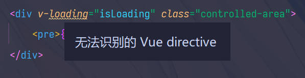
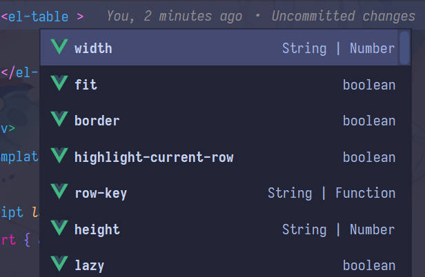
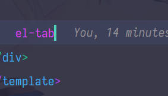
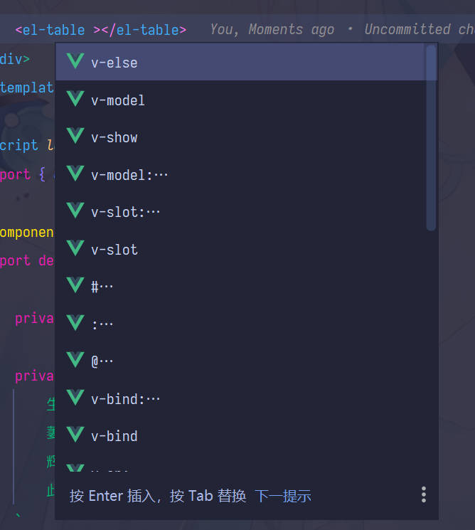

# 1. 无法识别的 Vue directive

# 2. `pnpm` 支持不完整

## 2.1 正常情况

> 当使用 `yarn` 安装依赖时, 一切正常: prop 属性有提示

## 2.2 不正常情况

> 完全删掉 `node_modules` 后, 使用 `pnpm install` 重新安装依赖
>
> node v16.14.2
> pnpm 7.11.0
> yarn 1.22.19

### 2.2.1 丢失了全局组件名称提示

### 2.2.2 丢失了 prop 提示

